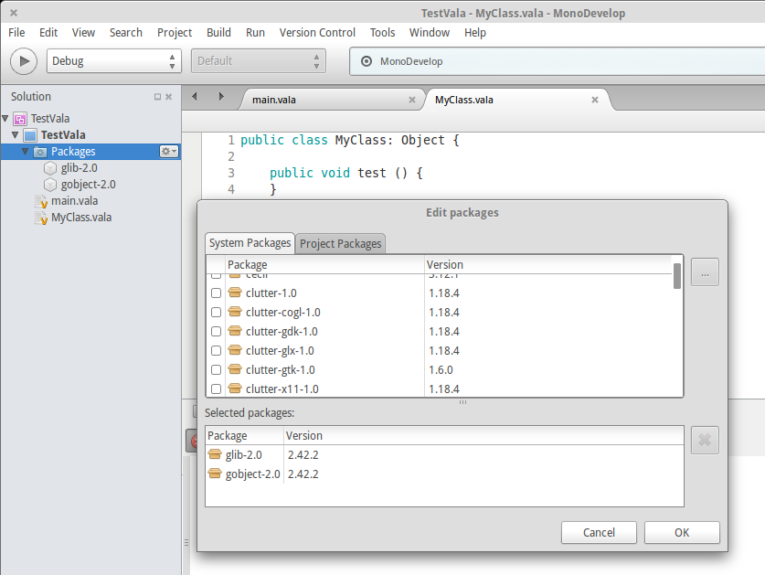

# Vala addin for Monodevelop 

ValaBinding is a Vala language binding for MonoDevelop.

# Features
* Vala project support for executable projects, libraries, and unit test projects (using GTest).
* Reference other Vala libraries and projects from within the IDE.
* Class browser.
* Basic Makefile integration.
* Breakpoints (via gdb)
* Full completion (code and packages. Using [afrodite](https://github.com/inizan-yannick/afrodite))
* Vala package management

# Screenshots

## Standard


## Debugging


## Vala package management


# How to build 
First we need to install [Mono for ubuntu](http://www.mono-project.com/docs/getting-started/install/linux/#debian-ubuntu-and-derivatives")
```
sudo apt-key adv --keyserver keyserver.ubuntu.com --recv-keys 3FA7E0328081BFF6A14DA29AA6A19B38D3D831EF
echo "deb http://download.mono-project.com/repo/debian wheezy main" | sudo tee /etc/apt/sources.list.d/mono-xamarin.list
sudo apt-get update
sudo apt-get install mono-complete
```
Then we install Monodevelop 
```
sudo apt-get install monodevelop 
```
Then we build the vala plugin and its dependencies
```
sudo apt-get install monodevelop-nunit monodevelop-versioncontrol 
sudo apt-get install libmono-addins-cil-dev libmono-addins-gui-cil-dev libmono-addins-gui0.2-cil libmono-addins-msbuild-cil-dev libmono-addins-msbuild0.2-cil libmono-addins0.2-cil mono-addins-utils

sudo apt-get install libvala-0.28-dev
git clone https://github.com/inizan-yannick/afrodite
cd afrodite
chmod +x autogen.sh
./autogen.sh --prefix=/usr && ./configure --prefix=/usr
make 
sudo make install
sudo ln -s  /usr/lib/libafrodite-0.28.so /usr/lib/libafrodite.so
```
And finally build the addin
```
git clone https://github.com/PerfectCarl/ValaBinding.git
cd ValaBinding
./autogen.sh --prefix=/usr && ./configure --prefix=/usr
make
sudo make install 
```

